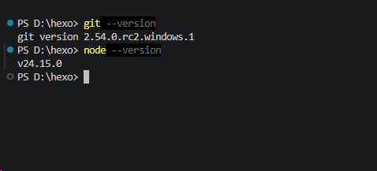
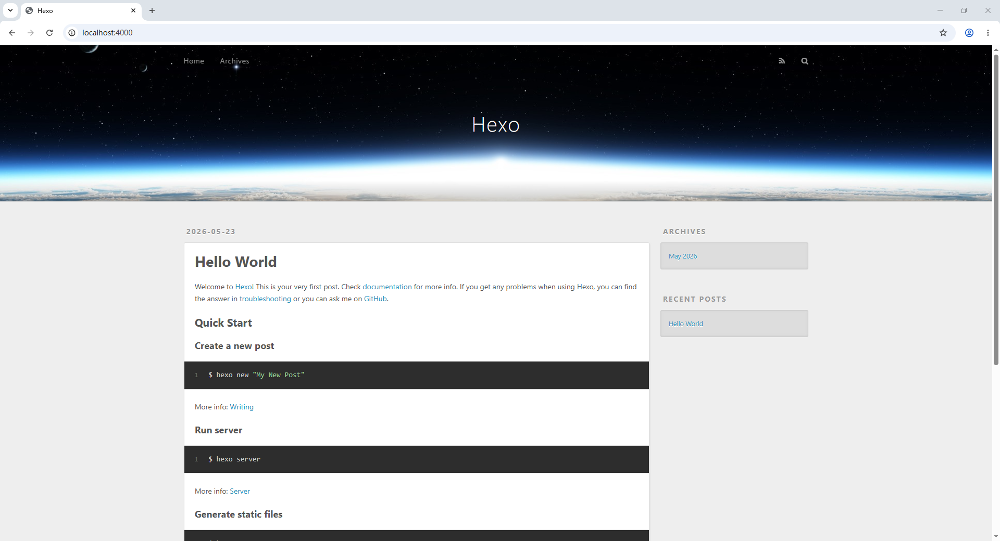

# 开始

你是否想和我一样拥有一个自己的博客呢，本篇文章将会教你通过两种方式来搭建属于自己的博客。

首先你需要选择想要搭建博客的类型，这里共有两种选择~

| 对比维度     | <iconify-icon icon="fe:wordpress"></iconify-icon>WordPress                                                                                    | <iconify-icon icon="simple-icons:hexo"></iconify-icon>Hexo                                                                                                          |
| :----------- | :-------------------------------------------------------------------------------------------------------------------------------------------- | :------------------------------------------------------------------------------------------------------------------------------------------------------------------ |
| **核心定位** | 功能完整的动态内容管理系统，适合博客、企业站、电商等                                                                                          | 基于 Node.js 的静态博客生成器，偏向个人博客与技术文档                                                                                                               |
| **主要优点** | ✅ 开箱即用，自带 Web 后台<br>✅ 插件/主题生态极其丰富<br>✅ 支持多用户、评论、搜索、表单等动态功能<br>✅ 非技术人员友好                      | ✅ 纯静态页面，访问速度极快<br>✅ 无数据库，安全性高<br>✅ 可免费托管（GitHub Pages / Vercel / Netlify）<br>✅ 对 CDN 和 SEO 友好<br>✅ Markdown 写作，Git 版本管理 |
| **主要不足** | ❌ 需要服务器 + 数据库，运维成本较高<br>❌ 动态页面对服务器资源有要求<br>❌ 需定期维护安全、更新插件和核心<br>❌ 默认不适合纯 Markdown 写作流 | ❌ 无原生后台，多设备写作需同步环境<br>❌ 动态功能依赖第三方服务（评论、搜索等）<br>❌ 对新手有一定技术门槛<br>❌ 每次更新需重新生成并部署                          |
| **部署环境** | - Web 服务器（Nginx / Apache）<br>- PHP + MySQL / MariaDB<br>- 支持一键安装（LAMP / WAMP / 宝塔）                                             | - 本地：Node.js + Git<br>- 生成后为纯静态文件<br>- 可部署至 GitHub Pages / Vercel / Netlify / OSS + CDN                                                             |

以上为两个类型的区别及优劣点，大家可根据自己需求和喜好进行选择~

# WordPress篇

> [!NOTE]
> 这个写起来有点麻烦，暑假再写吧。~~（咕咕咕）~~

# Hexo篇

本篇以Windows系列系统作为演示，其他系统大差不差，动手能力强的猫猫建议查阅官方文档~

## 准备工作

需要的环境有：

- [Node.js](https://nodejs.org/zh-cn)(最低版本10.13，建议使用12.0及以上版本)
- [Git](https://git-scm.com/)

> [!NOTE]
> 在Windows环境下安装Node.js时，请确保勾选 Add to PATH 选项（默认已勾选）

安装完毕后，建议按键盘上的 <iconify-icon icon="basil:windows-solid"></iconify-icon> + `R` 打开「运行」，然后输入`cmd`或`powershell`打开终端分别输入`git --version`和`node --version`查看是否安装完成，若能看到类似下图所示的内容，恭喜你安装完成🎉



## 安装Hexo

> [!IMPORTANT]
> 注意，本章节下所有命令均在上文中提到的`终端`中完成。

所有必备的应用程序安装完成后，即可使用`npm`安装`Hexo`。

```bash
npm install -g hexo-cli
```

## 建站

我们可以使用`hexo init`创建一个新的`Hexo`博客项目：

```bash
# 这里的 my-blog 是你的博客项目名称
hexo init my-blog
```

然后，进入博客目录

```bash
cd my-blog
```

所需要的依赖在`hexo init`的时候就已经安装了，我们这里可以先开启本地服务器看一下博客页面：

```bash
# hexo sever 与它一样
hexo s
```

如果没什么问题访问<http://localhost:4000>应该是如下图，正常显示：



默认主题太丑了，让我们给它换上[Butterfly](https://github.com/jerryc127/hexo-theme-butterfly)主题。当然，你也可以选其他主题，请见[主题列表](https://hexo.io/themes/)

## 安装主题

首先,在主题目录下执行以下命令:

```bash
# --depth 1 让git只克隆最后一次commit，加快克隆速度
git clone --depth 1 -b master https://gitee.com/immyw/hexo-theme-butterfly.git themes/butterfly
```

等待克隆完成后，修改`_config.yml`文件，把主题更改为`Butterfly`

```yaml
theme: butterfly
```

之后保存配置文件，执行以下命令安装`Butterfly`主题运行所需插件

```bash
npm install hexo-renderer-pug hexo-renderer-stylus --save
```

## 配置主题

> [!NOTE]
> 为了方便以后对主题进行升级，强烈建议把主题配置文件单独放在`Hexo`项目根目录下

在 hexo 的根目录创建一个文件`_config.butterfly.yml`，并把主题目录的`_config.yml`内容复制到`_config.butterfly.yml`去。

> [!IMPORTANT]
> 注意:
>
> 复制的是主题的`_config.yml`，而不是`Hexo`的`_config.yml`
>
> 不要把主题目录的`_config.yml`删掉
>
> 以后只需要在`_config.butterfly.yml`进行配置就行。如果使用了`_config.butterfly.yml`， 配置主题的`_config.yml`将不会有效果。

Hexo 会自动合并主题中的`_config.yml`和`_config.butterfly.yml`里的配置，如果存在同名配置，会使用`_config.butterfly.yml`的配置，其优先度较高。

现在，你的博客就已经变得非常不错了，有关`Butterfly`配置文件的进一步探索，详情请见[配置文档](https://butterfly.js.org/posts/dc584b87/)

## 部署到Github Pages

> [!NOTE]
> 如果你没有Github账号，请[点击此处](https://github.com/signup)来注册一个账号。注册所使用的邮箱建议使用QQ邮箱，格式为{你的QQ号}@qq.com

首先，在Github上创建一个公开仓库，其名称建议为`{你的Github用户名}.github.io`。当然，你也可以选择使用自定义域名，详情这里不过多赘述，请自行查找。

创建完成后，复制Git链接备用。

接下来我们在`Hexo`项目根目录下执行以下命令，安装[hexo-deployer-git](https://github.com/hexojs/hexo-deployer-git)

```bash
npm install hexo-deployer-git --save
```

编辑 `_config.yml` （示例值如下所示）：

```yaml
deploy:
  type: "git"
  repo: https://github.com/{你的GitHub用户名}/{你刚刚创建的仓库的名称}.git # 就是你创建仓库后复制的Git链接。
  branch: main
```

保存配置文件，在终端执行以下命令，构建文件并上传：

```bash
hexo clean
hexo g
hexo d
```

> [!NOTE]
>
> - 除非你使用**令牌**或 **SSH 密钥认证**，否则你会被提示提供目标仓库的用户名和密码。
> - `hexo-deployer-git`并不会存储你的用户名和密码。 请使用[git-credential-cache](https://git-scm.com/docs/git-credential-cache)来临时存储它们。

上传完成后请稍等片刻，你的博客大概率就能在{你的Github用户名}.github.io里看见了。
